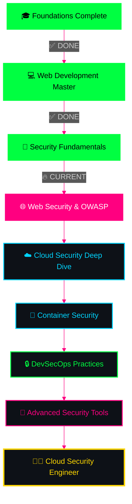

<!-- Epic typing animation -->
<div align="center" >
  
</div>


<br>

<!-- Matrix Hacker GIF -->


</div>

---

<!-- Glowing status badges -->
<div align="center">


</div>

---


## 🎯 `[CLASSIFIED] OPERATIVE PROFILE`

<div align="center">

<table>
<tr>
<td width="50%" valign="top">

```yaml
╔══════════════════════════════════════╗
║  AGENT ID: saviour2                  ║
║  NAME: Saikat Das                    ║
║  LOCATION: Kolkata, West Bengal      ║
║  INSTITUTION: GNIT                   ║
║  CLEARANCE: Level 3                  ║
║  DIVISION: Cyber Operations          ║
║  STATUS: Active Development          ║
╚══════════════════════════════════════╝

🎓 EDUCATION:
   └─ B.Tech (IT) - 2nd Year
   └─ Guru Nanak Institute of Technology
   └─ Expected Graduation: 2028
   
🎯 MISSION OBJECTIVE:
   └─ DevSecOps Engineer
   └─ Cloud Security Operations
   └─ AI/ML Security Integration
   
⚡ CURRENT OPERATIONS:
   └─ Google Student Ambassador
   └─ IBM SkillsBuild Intern
   └─ Open Source Contributor
```
<div align="center">
  
</div>

</td>
<td width="50%" valign="top">


<br>

### `💭 LIFE PHILOSOPHY`

```python
class SaikatDas:
    def __init__(self):
        self.name = "Saikat Das"
        self.role = "DevSecOps Engineer"
        self.location = "Kolkata, India"
    
    def say_hi(self):
        print("Building secure systems,")
        print("One commit at a time!")

me = SaikatDas()
me.say_hi()
```

### `📜 WISDOM`
*"The key to a happy life is to accept that you are never actually in control."*
**— Raymond Reddington**

</td>
</tr>
</table>

</div>

---


## 🏆 `[ELITE STATUS] LEADERSHIP & ACHIEVEMENTS`

<div align="center">

<table>
<tr>
<td width="50%" align="center">


### `🎓 GOOGLE STUDENT AMBASSADOR`

```diff
@@ GOOGLE GEMINI API - CAMPUS LEADER @@
+ Period: Aug 2025 - Dec 2025
+ Status: ACTIVE

[✓] Selected through competitive process
[✓] Leading AI workshops on campus
[✓] Organizing tech events & hackathons
[✓] Driving AI innovation discussions
[✓] Gathering community feedback
[✓] Representing Google Gemini
```

[](https://developers.google.com/community/ambassadors)

</td>
<td width="50%" align="center">


### `💼 IBM SKILLSBUILD INTERN`

```diff
@@ FRONT-END DEVELOPMENT INTERNSHIP @@
+ Program: AICTE Edunet x IBM
+ Period: Aug 2025 - Oct 2025
+ Status: IN PROGRESS

[✓] 6-week intensive program
[✓] Real-world project development
[✓] Industry mentor guidance
[✓] IBM SkillsBuild certification track
[✓] Professional skill development
```

[](https://skillsbuild.org/)

</td>
</tr>
</table>

<br>

### `🎖️ OPEN SOURCE WARRIOR`

<table>
<tr>
<td align="center">

[](https://holopin.io/@saviour2)

**🔥 HACKTOBERFEST 2025**
```
[████████████] 6/6 PRs MERGED
Status: SUPER CONTRIBUTOR
```

</td>
<td align="center">


**☁️ GOOGLE CLOUD CERTIFIED**
```
Cloud Computing Foundations
Status: CERTIFIED ✓
```

</td>
</tr>
</table>

### `🎓 ADDITIONAL CERTIFICATIONS`


</div>

---


## 🔥 `[ARSENAL] WEAPONS & TECH STACK`

<div align="center">

### `⚔️ PRIMARY WEAPONS`


### `☁️ CLOUD WARFARE & DEVOPS`


### `🛠️ DEVELOPMENT TOOLS`


</div>

<br>

<div align="center">
<table>
<tr>
<td width="33%" align="center">

### `💻 LANGUAGES`
```yaml
Primary:
  - Java ████████████ 90%
  - Python ██████████░ 85%
  - JavaScript ████████ 80%
  - C ███████████░ 88%

Database:
  - MySQL ████████░░░ 75%
```

</td>
<td width="33%" align="center">

### `🌐 WEB TECH`
```yaml
Frontend:
  - HTML5 ████████████ 95%
  - CSS3 ███████████░ 92%
  - JavaScript ████████ 80%
  - GSAP ██████████░░ 85%

Frameworks:
  - JavaFX ████████░░░ 75%
  - ASP.NET ███████░░░░ 70%
```

</td>
<td width="33%" align="center">

### `☁️ CLOUD & TOOLS`
```yaml
Cloud:
  - Google Cloud ██████ 65%
  - Cloud Security ████░ 45%

DevOps:
  - Git/GitHub ████████ 88%
  - Docker █████░░░░░░ 50%
  - Kubernetes ███░░░░░ 35%
```

</td>
</tr>
</table>
</div>

---


## 📊 `[INTEL] GITHUB OPERATIONS`

<div align="center">


<!-- Profile Summary -->


<table>
<tr>
<td width="50%">

</td>
<td width="50%">

</td>
</tr>
<tr>
<td width="50%">

</td>
<td width="50%">

</td>
</tr>
</table>

### `🏆 TROPHY COLLECTION`


### `🐍 CONTRIBUTION SNAKE`

<picture>
  <source media="(prefers-color-scheme: dark)" srcset="https://raw.githubusercontent.com/saviour2/saviour2/output/github-contribution-grid-snake-dark.svg">
  <source media="(prefers-color-scheme: light)" srcset="https://raw.githubusercontent.com/saviour2/saviour2/output/github-contribution-grid-snake.svg">
  
</picture>

</div>

---


## 🎯 `[PROJECTS] TACTICAL OPERATIONS`

<div align="center">


<table>
<tr>
<td width="50%" valign="top">

### 🖥️ **TERMINAL V1 - SECURITY PORTFOLIO**

```bash
┏━━━━━━━━━━━━━━━━━━━━━━━━━━━━━━━━┓
┃ PROJECT: Terminal Portfolio    ┃
┣━━━━━━━━━━━━━━━━━━━━━━━━━━━━━━━━┫
┃ [●] HTML5 + CSS3 + JavaScript  ┃
┃ [●] GSAP Animations            ┃
┃ [●] Particle.js Effects        ┃
┃ [●] Cyberpunk Terminal Theme   ┃
┃ [●] Fully Responsive Design    ┃
┣━━━━━━━━━━━━━━━━━━━━━━━━━━━━━━━━┫
┃ STATUS: 🟢 LIVE                ┃
┗━━━━━━━━━━━━━━━━━━━━━━━━━━━━━━━━┛
```

[](https://terminalv1.pages.dev/)
[](https://github.com/saviour2/Portfolio)

**Features:** Animated terminal interface, particle effects, smooth scrolling, glassmorphism design, cyberpunk aesthetic

</td>
<td width="50%" valign="top">

### 🛒 **E-COMMERCE APPLICATION**

```bash
┏━━━━━━━━━━━━━━━━━━━━━━━━━━━━━━━━┓
┃ PROJECT: Desktop E-Commerce    ┃
┣━━━━━━━━━━━━━━━━━━━━━━━━━━━━━━━━┫
┃ [●] Java + JavaFX GUI          ┃
┃ [●] MySQL Database             ┃
┃ [●] User Authentication        ┃
┃ [●] Product Management         ┃
┃ [●] Cart & Wishlist System     ┃
┣━━━━━━━━━━━━━━━━━━━━━━━━━━━━━━━━┫
┃ STATUS: 🟡 COMPLETE            ┃
┗━━━━━━━━━━━━━━━━━━━━━━━━━━━━━━━━┛
```

[](https://github.com/saviour2/miniproj)

**Features:** Dual portals (customer/seller), product CRUD, MySQL integration, secure login system, wishlist & cart functionality

</td>
</tr>
</table>


</div>

---


## 🎓 `[ROADMAP] MASTER PLAN - DEVSECOPS JOURNEY`

<div align="center">


### `🗺️ THE ULTIMATE PATH TO DEVSECOPS MASTERY`

</div>



<div align="center">

<table>
<tr>
<td width="33%" valign="top">

### ✅ `PHASE 1: FOUNDATIONS`
**STATUS: COMPLETE**

```yaml
Core Programming:
  - Java ████████████ 90%
  - Python ██████████░ 85%
  - C Programming ████ 88%

Web Development:
  - HTML5/CSS3 ███████ 95%
  - JavaScript ███████ 80%
  - GSAP/Animations ██ 85%

Version Control:
  - Git/GitHub ██████░ 88%

Database:
  - MySQL █████████░░ 75%
```

**🎯 Achievements:**
- ✅ Built 10+ web projects
- ✅ E-Commerce app with JavaFX
- ✅ Terminal portfolio (GSAP)
- ✅ Google Cloud certified
- ✅ IBM SkillsBuild intern

</td>
<td width="33%" valign="top">

### 🔥 `PHASE 2: SECURITY CORE`
**STATUS: IN PROGRESS**

```yaml
OWASP Top 10:
  - SQL Injection ████░ 40%
  - XSS Attacks ███░░░░ 35%
  - CSRF ███░░░░░░░░░░ 30%
  - Auth Issues ████░░░ 45%

Web Security:
  - Burp Suite ███░░░░░ 30%
  - OWASP ZAP ██░░░░░░░ 25%
  - Nikto ██░░░░░░░░░░ 20%

Cloud Security:
  - GCP IAM ████░░░░░░░ 40%
  - Security Groups ███ 35%
  - VPC Config ███░░░░░ 30%

Linux:
  - Command Line █████░ 70%
  - Shell Scripting ██ 50%
```

**🎯 Current Goals:**
- 🔄 Master OWASP Top 10
- 🔄 Complete web pentest labs
- 🔄 Practice CTF challenges
- 🔄 Build vulnerable apps

</td>
<td width="33%" valign="top">

### 🎯 `PHASE 3: DEVSECOPS`
**STATUS: UPCOMING**

```yaml
Container Security:
  - Docker Security ░░░ 10%
  - Kubernetes ░░░░░░░░ 5%
  - Container Scanning  0%

CI/CD Security:
  - Jenkins ░░░░░░░░░░░ 0%
  - GitLab CI ░░░░░░░░░ 0%
  - SAST/DAST ░░░░░░░░░ 0%

Advanced Tools:
  - Terraform ░░░░░░░░░ 0%
  - Ansible ░░░░░░░░░░░ 0%
  - SonarQube ░░░░░░░░░ 0%

Cloud SecOps:
  - SIEM Tools ░░░░░░░░ 0%
  - Incident Response ░ 0%
  - Compliance ░░░░░░░░ 0%
```

**🎯 Future Targets:**
- 📌 DevSecOps pipeline
- 📌 K8s security hardening
- 📌 Cloud compliance
- 📌 Security automation

</td>
</tr>
</table>

### `📚 LEARNING STACK - DETAILED ROADMAP`

<table>
<tr>
<td width="25%" align="center">

**🔐 SECURITY FUNDAMENTALS**
```
├─ OWASP Top 10
├─ Web Vulnerabilities
├─ Network Security
├─ Cryptography
└─ Secure Coding
```

</td>
<td width="25%" align="center">

**☁️ CLOUD SECURITY**
```
├─ GCP Security
├─ IAM & Access Control
├─ VPC & Networking
├─ Cloud Encryption
└─ Security Monitoring
```

</td>
<td width="25%" align="center">

**🐳 CONTAINER SECURITY**
```
├─ Docker Security
├─ Kubernetes Hardening
├─ Image Scanning
├─ Runtime Security
└─ Pod Security
```

</td>
<td width="25%" align="center">

**🔒 DEVSECOPS TOOLS**
```
├─ CI/CD Security
├─ SAST/DAST Tools
├─ IaC Security
├─ Secrets Management
└─ Security Automation
```

</td>
</tr>
</table>

### `🎯 MILESTONES & CERTIFICATIONS TARGET`


</div>

---


## 🌐 `[NETWORK] ESTABLISH CONNECTION`

<div align="center">


### `🔗 SECURE COMMUNICATION CHANNELS`

<table>
<tr>
<td align="center" width="20%">

[](https://github.com/saviour2)
<br>

<br>
**Source Code**

</td>
<td align="center" width="20%">

[](https://www.linkedin.com/in/saikat-das-cloud/)
<br>

<br>
**Professional**

</td>
<td align="center" width="20%">

[](mailto:saikatd016@gmail.com)
<br>

<br>
**Direct Mail**

</td>
<td align="center" width="20%">

[](https://x.com/Saikatd007)
<br>

<br>
**Social Feed**

</td>
<td align="center" width="20%">

[](https://www.instagram.com/batsy_007/)
<br>

<br>
**Visual Feed**

</td>
</tr>
</table>

<br>

### `🌐 PORTFOLIO & PROJECTS`

[](https://terminalv1.pages.dev/)

<br>

### `📍 LOCATION & INFO`


</div>

---


## 💾 `[DATABASE] CLASSIFIED INTEL`

<details>
<summary><b>🔐 OPERATIVE DOSSIER</b> <i>(Click to decrypt classified information)</i></summary>

<br>

<div align="center">

</div>

```yaml
╔═══════════════════════════════════════════════════════════════╗
║                    CLASSIFIED DOSSIER                         ║
║                 [SECURITY CLEARANCE: LEVEL 3]                 ║
╠═══════════════════════════════════════════════════════════════╣
║                                                               ║
║  PERSONAL IDENTIFICATION:                                     ║
║    Full Name: Saikat Das                                      ║
║    Call Sign: saviour2                                        ║
║    Contact: +91 7304591240                                    ║
║    Email: saikatd016@gmail.com                                ║
║    Location: Kolkata, West Bengal, India                      ║
║    Time Zone: IST (UTC+5:30)                                  ║
║                                                               ║
║  ACADEMIC CREDENTIALS:                                        ║
║    Institution: Guru Nanak Institute of Technology            ║
║    Program: Bachelor of Technology                            ║
║    Specialization: Information Technology                     ║
║    Current Year: 2nd Year (2023-2028)                         ║
║    SGPA: 8.82/10.00 [TOP PERFORMER]                           ║
║                                                               ║
║  PROFESSIONAL STATUS:                                         ║
║    ├─ Google Student Ambassador (Aug 2025 - Dec 2025)         ║
║    │  └─ Role: Campus Leader for Google Gemini API            ║
║    │  └─ Responsibilities: AI Workshops, Events, Community    ║
║    │                                                          ║
║    └─ IBM SkillsBuild Intern (Aug 2025 - Oct 2025)            ║
║       └─ Program: AICTE Edunet Front-End Development          ║
║       └─ Status: Building real-world projects                 ║
║                                                               ║
║  MISSION OBJECTIVES:                                          ║
║    Primary Target: DevSecOps Engineer                         ║
║    Secondary Target: Cloud Security Operations                ║
║    Tertiary Target: AI/ML Security Integration                ║
║                                                               ║
║  OPERATIONAL CAPABILITIES:                                    ║
║                                                               ║
║    [PROGRAMMING ARSENAL]                                      ║
║    ├─ Java (Primary Weapon)              ████████████ 90%     ║
║    ├─ Python (Automation)                ██████████░░ 85%     ║
║    ├─ C (System Programming)             ███████████░ 88%     ║
║    └─ JavaScript (Web Operations)        ████████░░░░ 80%     ║
║                                                               ║
║    [WEB TECHNOLOGIES]                                         ║
║    ├─ HTML5                              ████████████ 95%     ║
║    ├─ CSS3 (Tailwind, GSAP)              ███████████░ 92%     ║
║    ├─ JavaScript (ES6+)                  ████████░░░░ 80%     ║
║    ├─ JavaFX (Desktop GUI)               ████████░░░░ 75%     ║
║    └─ ASP.NET Core                       ███████░░░░░ 70%     ║
║                                                               ║
║    [DATABASE OPERATIONS]                                      ║
║    └─ MySQL (Relational DB)              ████████░░░░ 75%     ║
║                                                               ║
║    [CLOUD & DEVOPS]                                           ║
║    ├─ Google Cloud Platform              ███████░░░░░ 65%     ║
║    ├─ Git/GitHub                         █████████░░░ 88%     ║
║    ├─ Docker (Learning)                  █████░░░░░░░ 50%     ║
║    └─ Kubernetes (Training)              ███░░░░░░░░░ 35%     ║
║                                                               ║
║    [SECURITY TOOLKIT - IN DEVELOPMENT]                        ║
║    ├─ OWASP Top 10                       ████░░░░░░░░ 40%     ║
║    ├─ Web Vulnerabilities                ████░░░░░░░░ 45%     ║
║    ├─ Burp Suite                         ███░░░░░░░░░ 30%     ║
║    ├─ OWASP ZAP                          ██░░░░░░░░░░ 25%     ║
║    ├─ Linux Security                     ███████░░░░░ 70%     ║
║    └─ Cloud Security (GCP)               ████░░░░░░░░ 40%     ║
║                                                               ║
║  VERIFIED CERTIFICATIONS:                                     ║
║    [✓] Google Cloud Computing Foundations                     ║
║    [✓] Web Development (Infosys SpringBoard)                  ║
║    [✓] ASP.NET Core Fundamentals (Microsoft Learn)            ║
║    [✓] Data Analytics Job Simulation (Deloitte - Forage)      ║
║    [✓] Cyber Security Job Simulation (Forage)                 ║
║    [✓] AI for Beginners (HP Life)                             ║
║    [✓] Hacktoberfest 2024 - Super Contributor (6 PRs)         ║
║                                                               ║
║  OPERATIONAL ACHIEVEMENTS:                                    ║
║    ├─ Built 10+ Web Development Projects                      ║
║    ├─ E-Commerce Desktop Application (Java + MySQL)           ║
║    ├─ Terminal V1 Portfolio (GSAP + Particle.js)              ║
║    ├─ 6 Open Source Contributions (Hacktoberfest 2024)        ║
║    └─ Active Community Member & Event Organizer               ║
║                                                               ║
║  PERSONAL ATTRIBUTES:                                         ║
║    ├─ Leadership: Google Student Ambassador                   ║
║    ├─ Resilience: Consistently high academic performance      ║
║    ├─ Motivation: Self-driven learning & project building     ║
║    ├─ Community: Active in tech events & workshops            ║
║    └─ Innovation: Exploring AI/ML + Security integration      ║
║                                                               ║
║  INTERESTS & HOBBIES:                                         ║
║    Professional:                                              ║
║    ├─ 🔐 Cybersecurity & Ethical Hacking                      ║
║    ├─ ☁️ Cloud Security Architecture                          ║
║    ├─ 🤖 AI/ML Security Applications                          ║
║    ├─ 🐍 Python Automation & Scripting                        ║
║    ├─ 💻 Terminal Aesthetics & Customization                  ║
║    └─ 🎮 CTF Challenges (Beginner Level)                      ║
║                                                               ║
║    Personal:                                                  ║
║    ├─ 📸 Photography (Digital & Landscape)                    ║
║    ├─ 🌱 Gardening (Stress Management)                        ║
║    ├─ 📖 Reading (Cybersecurity Blogs & Thrillers)            ║
║    ├─ 🎬 Movies & Series (Sci-Fi, Crime, Tech)                ║
║    └─ 🎵 Music (Electronic, Ambient, Lo-fi)                   ║
║                                                               ║
║  CURRENT PROJECTS & RESEARCH:                                 ║
║    [ACTIVE OPERATIONS]                                        ║
║    ├─ 🔴 OWASP Vulnerability Lab Setup (Private)              ║
║    ├─ 🟢 Cloud Security Best Practices Study                  ║
║    ├─ 🟡 Python Security Automation Scripts                   ║
║    ├─ 🔵 Terminal V1 Portfolio Maintenance                    ║
║    └─ 🟣 IBM SkillsBuild Internship Project                   ║
║                                                               ║
║  FUTURE ASPIRATIONS:                                          ║
║    ├─ Master DevSecOps Practices & Tools                      ║
║    ├─ Obtain Industry Security Certifications                 ║
║    │  └─ AWS Security Specialty, CEH, OSCP                    ║
║    ├─ Contribute to Major Security Open Source Projects       ║
║    ├─ Build AI-Powered Security Tools                         ║
║    └─ Become Cloud Security Operations Engineer               ║
║                                                               ║
║  LEARNING PHILOSOPHY:                                         ║
║    "Security is not a destination, but a continuous journey   ║
║     of learning, adapting, and protecting."                   ║
║                                                               ║
║  AVAILABILITY:                                                ║
║    Status: ACTIVE - Open to opportunities                     ║
║    Mode: Internships, Freelance, Collaborations               ║
║    Focus: DevSecOps, Cloud Security, Web Security             ║
║                                                               ║
╚═══════════════════════════════════════════════════════════════╝
```

</details>

<details>
<summary><b>⚡ OPERATIONAL LOG</b> <i>(Click to view recent activities)</i></summary>

<br>

```bash
┌──(saviour2㉿terminal)-[~/operations]
└─$ git log --oneline --graph --all --decorate --color

* 🔴 a3f9c21 (HEAD -> main, origin/main) 🔒 OPERATION: Web Security Research
|   Date: October 2024
|   └─ Studying OWASP Top 10 vulnerabilities
|   └─ Setting up local pentest environment (DVWA)
|   └─ Learning XSS, SQL Injection, CSRF techniques
|   └─ Practicing with Burp Suite and OWASP ZAP
|   └─ Building vulnerable test applications
|
* 🔵 b8e4d52 💼 MILESTONE: IBM SkillsBuild Internship Started
|   Date: August 2025
|   └─ Selected for AICTE Edunet x IBM program
|   └─ 6-week intensive front-end development training
|   └─ Working on real-world project with mentor
|   └─ Learning modern web development practices
|
* 🟢 c9a1f83 🎓 ACHIEVEMENT: Google Student Ambassador
|   Date: August 2025
|   └─ Selected as GSA for Google Gemini API
|   └─ Planning AI workshops and tech events
|   └─ Building campus tech community
|   └─ Representing Google on campus
|
* 🟡 d2b7e94 ⭐ VICTORY: Hacktoberfest 2024 Super Contributor
|   Date: October 2024
|   └─ 6 Pull Requests successfully merged
|   └─ Contributed to 4 different repositories
|   └─ Fixed bugs and improved documentation
|   └─ Earned Super Contributor badge
|
* 🟣 e5c3a15 🌐 DEPLOYMENT: Terminal Portfolio V1
|   Date: September 2024
|   └─ Built cyberpunk-themed security portfolio
|   └─ Implemented GSAP animations & Particle.js
|   └─ Deployed on Cloudflare Pages
|   └─ Performance optimization completed
|   └─ Live at: https://terminalv1.pages.dev/
|
* 🔵 f8d9b26 ☁️ CERTIFICATION: Google Cloud Foundations
|   Date: August 2024
|   └─ Completed Cloud Computing Fundamentals
|   └─ Learned GCP services, IAM, VPC, networking
|   └─ Badge earned and certificate issued
|   └─ Foundation for cloud security journey
|
* 🟢 g7h8i37 🛒 PROJECT: E-Commerce Desktop Application
|   Date: June 2024
|   └─ Built Java + JavaFX application
|   └─ Implemented MySQL database
|   └─ User authentication & product management
|   └─ Cart and wishlist functionality
|   └─ Dual portals for customers & sellers
|
* 🟡 h9i0j48 💻 MILESTONE: Frontend Development Mastery
|   Date: May 2024
|   └─ Completed 10+ web development projects
|   └─ Mastered HTML5, CSS3, JavaScript
|   └─ Advanced animations with GSAP
|   └─ Responsive design & modern CSS
|
* 🔴 i1j2k59 🚀 INITIATION: DevSecOps Journey Begins
|   Date: March 2024
|   └─ Started cybersecurity learning path
|   └─ Set up Kali Linux environment
|   └─ Began OWASP documentation study
|   └─ Defined roadmap to DevSecOps Engineer
|
* 🟢 j3k4l60 📚 FOUNDATION: Programming Fundamentals
|   Date: 2023-2024
|   └─ Learned Java, Python, C programming
|   └─ Built first portfolio website
|   └─ Version control with Git/GitHub
|   └─ Started contributing to open source

[●] ONGOING OPERATIONS (ACTIVE):
    🔴 Web vulnerability research & practice labs
    🟢 IBM SkillsBuild internship project
    🔵 Google Student Ambassador events planning
    🟡 OWASP Top 10 certification preparation
    🟣 Cloud security architecture design study
    ⚪ Python automation scripts development
    🟠 CTF challenge participation (beginner)
    
[●] NEXT TARGETS (UPCOMING):
    📌 Complete OWASP Top 10 hands-on labs
    📌 Build vulnerable web application for testing
    📌 Deploy first cloud security project (GCP)
    📌 Contribute to security-focused open source
    📌 Start learning Docker & Kubernetes security
    📌 Begin preparing for CEH certification
    
[●] SYSTEM STATUS: ALL SYSTEMS OPERATIONAL ✓
    └─ Learning Mode: ACTIVE
    └─ Project Mode: BUILDING
    └─ Community Mode: ENGAGING
    └─ Security Clearance: LEVEL 3
```

</details>

---


## 🌟 `[SHOWCASE] FEATURED REPOSITORIES`

<div align="center">

<table>
<tr>
<td width="50%">

<a href="https://github.com/saviour2/Portfolio">
  
</a>

**🖥️ Terminal V1 Portfolio**
```yaml
Type: Web Application
Tech: HTML5, CSS3, JavaScript, GSAP
Features: Cyberpunk theme, Animations
Status: 🟢 LIVE - terminalv1.pages.dev
Stars: ⭐ Featured Project
```

[](https://terminalv1.pages.dev/)

</td>
<td width="50%">

<a href="https://github.com/saviour2/miniproj">
  
</a>

**🛒 E-Commerce Desktop App**
```yaml
Type: Desktop Application
Tech: Java, JavaFX, MySQL
Features: User auth, CRUD, Cart system
Status: 🟡 COMPLETE
Stars: ⭐ Academic Project
```

[](https://github.com/saviour2/miniproj)

</td>
</tr>
</table>

### `📚 EXPLORE ALL REPOSITORIES`

[](https://github.com/saviour2?tab=repositories)
[](https://github.com/saviour2?tab=stars)

</div>

---


## 💡 `[WISDOM] HACKER QUOTES`

<div align="center">


<br><br>

```
 ╔════════════════════════════════════════════════════════╗
 ║  "Security is not a product, but a process."           ║
 ║                                  — Bruce Schneier      ║
 ╚════════════════════════════════════════════════════════╝
```

```
 ╔════════════════════════════════════════════════════════╗
 ║  "In the world of security, there are two types of     ║
 ║   companies: those that have been hacked, and those    ║
 ║   that don't know they've been hacked yet."            ║
 ║                                  — John Chambers       ║
 ╚════════════════════════════════════════════════════════╝
```

</div>

---


## ⭐ `[SUPPORT] SHOW APPRECIATION`

<div align="center">


### `💖 IF YOU LIKE MY WORK`

```bash
┌──(visitor㉿github)-[~/show-support]
└─$ ./appreciate.sh

[?] How would you like to support?
    [1] ⭐ Star my repositories
    [2] 🔀 Fork interesting projects  
    [3] 👁️  Follow for updates
    [4] 📣 Share with your network
    [5] 💬 Open issues/discussions
    [6] 🤝 Collaborate on projects
    
[✓] Every star ⭐ motivates me to build more!
[✓] Every follow 👁️  keeps me accountable!
[✓] Every fork 🔀 validates my work!
[✓] Every contribution 🤝 grows the community!
```

<table>
<tr>
<td align="center" width="33%">

[](https://github.com/saviour2?tab=followers)

**👥 Join the Team**
<br>
<sub>Follow for daily updates</sub>

</td>
<td align="center" width="33%">

[](https://github.com/saviour2?tab=repositories)

**⭐ Star Power**
<br>
<sub>Show some love</sub>

</td>
<td align="center" width="33%">

[](https://github.com/saviour2?tab=repositories)

**📦 Projects**
<br>
<sub>Explore my work</sub>

</td>
</tr>
</table>

### `🎯 QUICK ACTIONS`

[](https://github.com/saviour2?tab=repositories)
[](https://github.com/saviour2)
[](https://terminalv1.pages.dev/)
[](https://www.linkedin.com/in/saikat-das-cloud/)
[](https://x.com/Saikatd007)

</div>

---


## 🔐 `[FINALE] SESSION TERMINATION`

<div align="center">


```
╔══════════════════════════════════════════════════════════════════════╗
║                                                                      ║
║              🔒 INITIATING SECURE SESSION TERMINATION 🔒             ║
║                                                                      ║
║  [✓] All operations logged and encrypted                             ║
║  [✓] Connections secured with TLS 1.3                                ║
║  [✓] Data integrity verified - No breaches detected                  ║
║  [✓] Surveillance protocols remain active                            ║
║  [✓] Session artifacts saved to secure storage                       ║
║                                                                      ║
║  > "The only truly secure system is one that is powered off,         ║
║     cast in a block of concrete and sealed in a lead-lined room      ║
║     with armed guards - and even then I have my doubts."             ║
║                                          — Gene Spafford             ║
║                                                                      ║
║  💡 Stay curious, stay secure, keep learning, keep building! 💡      ║
║                                                                      ║
╚══════════════════════════════════════════════════════════════════════╝
```

### `📊 SESSION STATISTICS`

```bash
┌─[TERMINAL]─[~]
└──╼ $ cat session_analytics.log

╭─────────────────────────────────────╮
│  SESSION ANALYTICS                  │
├─────────────────────────────────────┤
│  Profile Views: [REAL-TIME]         │
│  Total Repos: [CALCULATING...]      │
│  Contributions: [PROCESSING...]     │
│  Security Level: MAXIMUM            │
│  Encryption: AES-256-GCM            │
│  Status: ALL SYSTEMS NOMINAL ✓      │
│  Uptime: 100%                       │
│  Last Updated: October 2024         │
╰─────────────────────────────────────╯

[●] Thanks for visiting my digital fortress!
[●] If you found this interesting, consider:
    ├─ ⭐ Starring my repositories
    ├─ 👁️  Following for updates
    ├─ 🤝 Connecting on LinkedIn
    └─ 💬 Reaching out for collaborations

[●] Stay secure, stay curious! 🔐
[●] Happy hacking! (the ethical kind 😉)
[●] ~ saviour2
```

<br>

[](https://github.com/saviour2)
[](https://github.com/saviour2)
[](https://github.com/saviour2)

<br>

```ascii
  ╔═══════════════════════════════════════════════════════════╗
  ║                                                           ║
  ║   > Connection closed by foreign host                     ║
  ║   > Cleaning up temporary files...                        ║
  ║   > Logging out from terminal...                          ║
  ║   > Wiping session traces...                              ║
  ║   > Session terminated successfully ✓                     ║
  ║                                                           ║
  ║   "Until next time, stay 1337!" 🤘                        ║
  ║   "Keep building, keep securing!" 🛡️                      ║
  ║                                                           ║
  ║   Have a secure day! :)                                   ║
  ║                                                           ║
  ╚═══════════════════════════════════════════════════════════╝
```

</div>

<!-- Animated Footer with gradient -->


<!-- Easter Egg & Credits -->
<div align="center">
<sub>🥚 <b>Easter Egg:</b> You found the end! Here's a cookie 🍪 and a virtual high-five ✋</sub>
<br>
<sub><i>Crafted with ❤️ by <a href="https://github.com/saviour2">Saikat Das (@saviour2)</a> | Last Updated: October 2024</i></sub>
<br>
<sub><i>"Building secure systems, one commit at a time" 🔐</i></sub>
</div>
